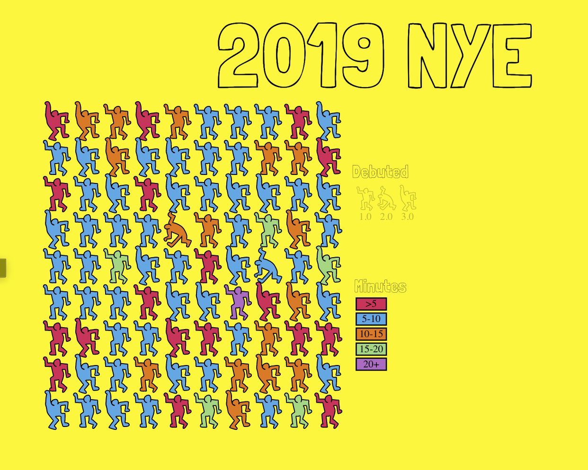

# 30DayChartChallenge

Creating a plot everyday in April 2021 for the #30DayChartChallenge 
https://github.com/Z3tt/30DayChartChallenge_Collection2021

| Challenge | Plot |
| --- | --- |
| piece-to-whole |  |
| pictogram |  |
| historical |  |
| magical |  |
| slope |  |
| experimental |  |
| physical |  |
| animal |  |
| statistics |  |
| abstract |  |
| circular |  |
| strips |  |
| correlation |  |
| space |  |
| multivariate |  |
| trees |  |
| pop culture |  |
| connections |  |
| global change |  |
| upwards |  |
| downwards |  |
| animation |  |
| tiles |  |
| monochrome |  |
| demographic |  |
| trends |  |
| educational |  |
| future |  |
| deviations |  |
| 3D |  |
| 3D |  |
